------
## 
Yue Pan (潘越)

I am an incoming Phd student at [Photogrammetry & Robotics Lab](https://www.ipb.uni-bonn.de/) at Bonn University, under the supervision of Prof. Cyrill Stachniss. My research interest is on 3D vision, photogrammetry and SLAM.

I obtained my Master and Bachelor degree in Geomatics Engineering from [ETH Zurich](https://ethz.ch/en.html) in 2022 and [Wuhan University](https://en.whu.edu.cn/) in 2019 with distinction, respectively. 

My detailed CV can be found in my [Linkedin](https://www.linkedin.com/in/yue-pan-59461b148/).

-----

### 
Publications

Full list: [Google Scholar](https://scholar.google.com/citations?hl=en&user=PUlWya8AAAAJ)

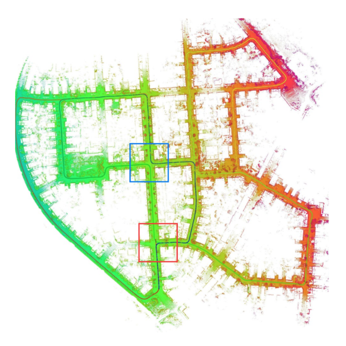**MULLS: Versatile LiDAR SLAM via Multi-metric Linear Least Square**

**Yue Pan**, Pengchuan Xiao, [Yujie He](https://yujie-he.github.io/), Zhenlei Shao, Zesong Li

*ICRA, 2021* 

[paper](https://arxiv.org/pdf/2102.03771.pdf) / [code](https://github.com/YuePanEdward/MULLS) / [video](https://www.youtube.com/watch?v=85bGD55e3-0&feature=youtu.be) / [presentation](https://www.youtube.com/watch?v=03ivl57AUEU)

------

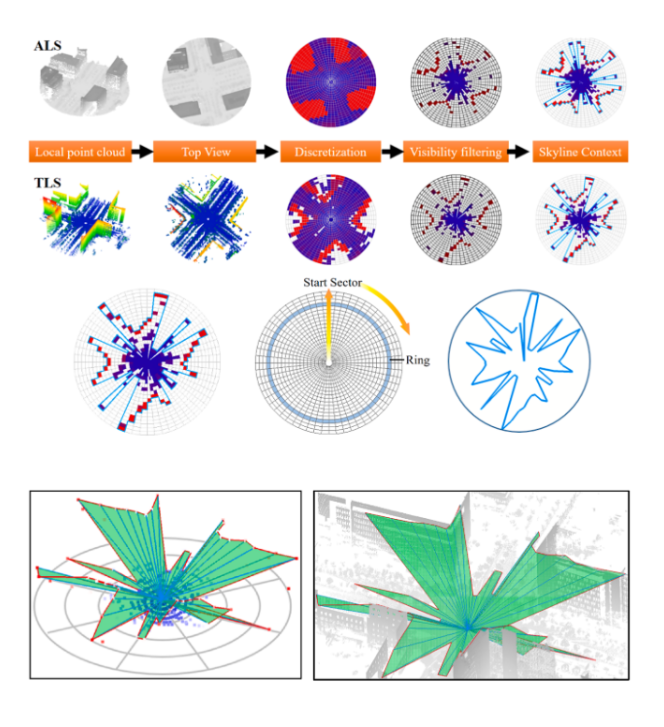**A novel skyline context descriptor for rapid localization of terrestrial laser scans to airborne laser scanning point clouds**

Fuxun Liang, [Bisheng Yang](http://3s.whu.edu.cn/ybs/index.htm), [Zhen Dong](http://jszy.whu.edu.cn/dongzhen/zh_CN/index.htm), Ronggang Huang, Yufu Zang, **Yue Pan**

*ISPRS P&RS, 2020*

[paper](https://www.sciencedirect.com/science/article/pii/S0924271620301155#f0015)

--------

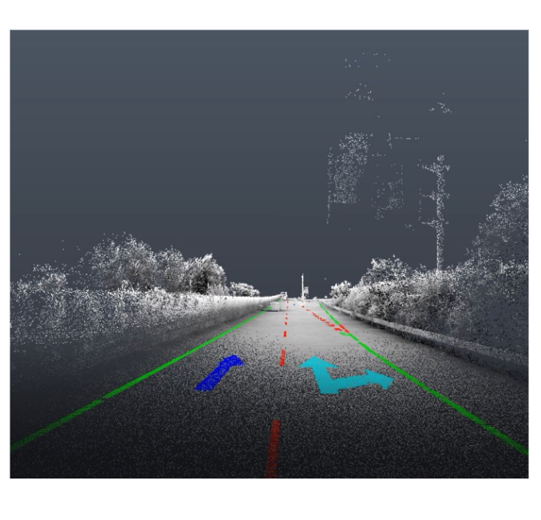**Automatic Road Markings Extraction, Classification and Vectorization from Mobile Laser Scanning Data**

**Yue Pan**, [Bisheng Yang](http://3s.whu.edu.cn/ybs/index.htm), Shengfu Li, Hong Yang, [Zhen Dong](http://jszy.whu.edu.cn/dongzhen/zh_CN/index.htm), Xue Yang

 *ISPRS Archive GSW, 2019*

 [paper](https://www.int-arch-photogramm-remote-sens-spatial-inf-sci.net/XLII-2-W13/1089/2019/) / [code](https://github.com/YuePanEdward/RoadMarkingExtraction)

------

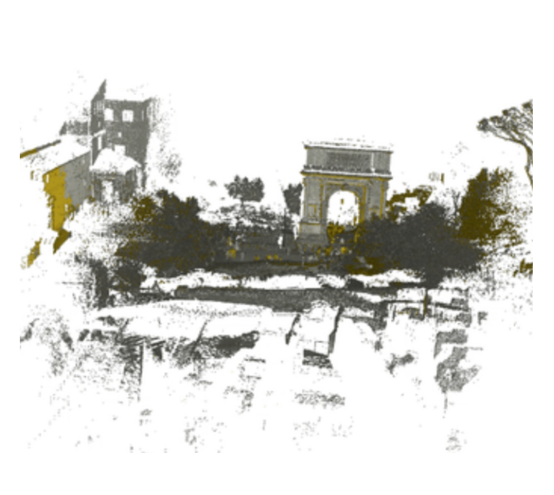**Iterative Global Similarity Points: A robust coarse-to-fine integration solution for pairwise 3D point cloud registration**

**Yue Pan**, [Bisheng Yang](http://3s.whu.edu.cn/ybs/index.htm), Fuxun Liang, [Zhen Dong](http://jszy.whu.edu.cn/dongzhen/zh_CN/index.htm)

*3DV, 2018*   

[paper](https://ieeexplore.ieee.org/abstract/document/8490968) / [code](https://github.com/YuePanEdward/GH-ICP) 

-------

### 
Selected Projects

Student Projects done in ETHZ & WHU:

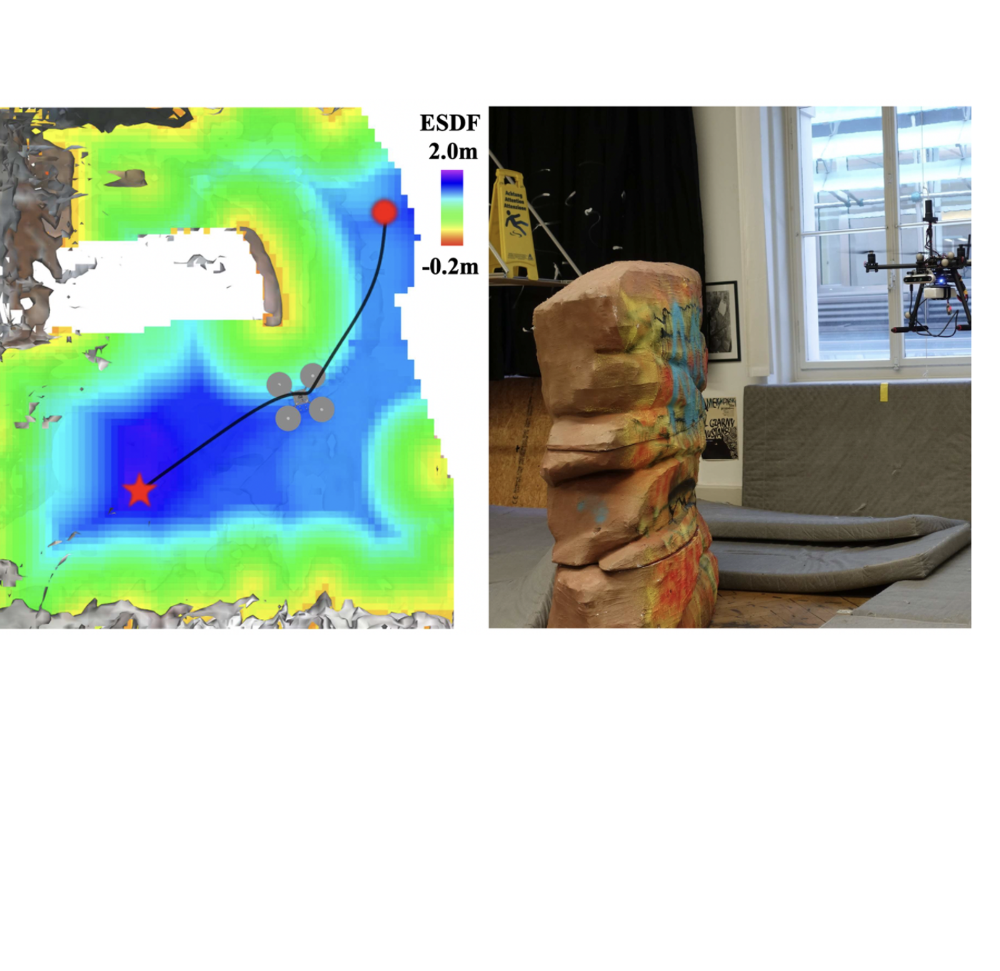**Mapping for online path planning and 3D reconstruction** (Master thesis)

 **Yue Pan**, supervisor: Yves Kompis, Luca Bartolomei, Ruben Mascaro, Margarita Chli, Konrad Schindler

 report / paper / code / video (coming soon)

----------------------

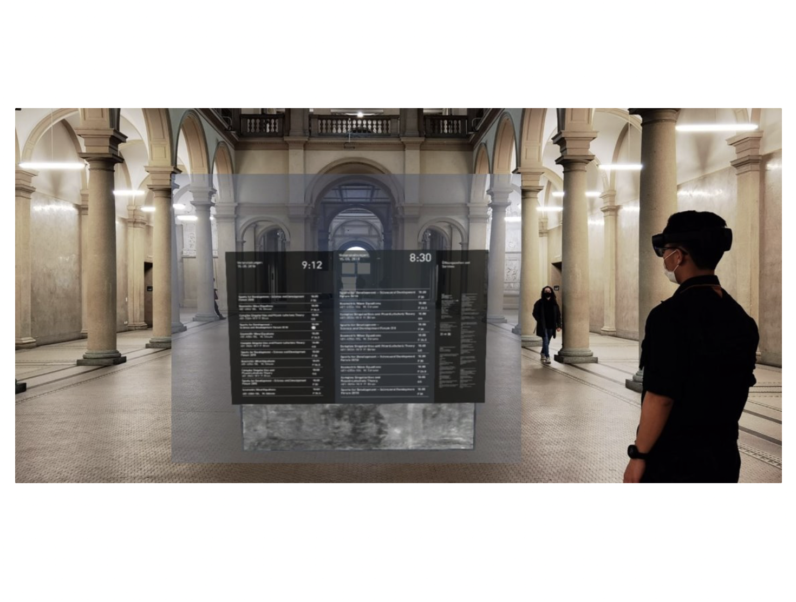 **HoloSign: the future of sign design** (GIS Lab Project)

 Yun-Tuan Chang, Bingxin Ke, Yuanwen Yue, **Yue Pan**, Jingyan Li,    supervisor: Peter Kiefer, Tiffany Kwok, Ye Hong, Luis Lutnyk

 code / [video](https://www.youtube.com/watch?v=IM2H0lR6HdU)
 

---------------------

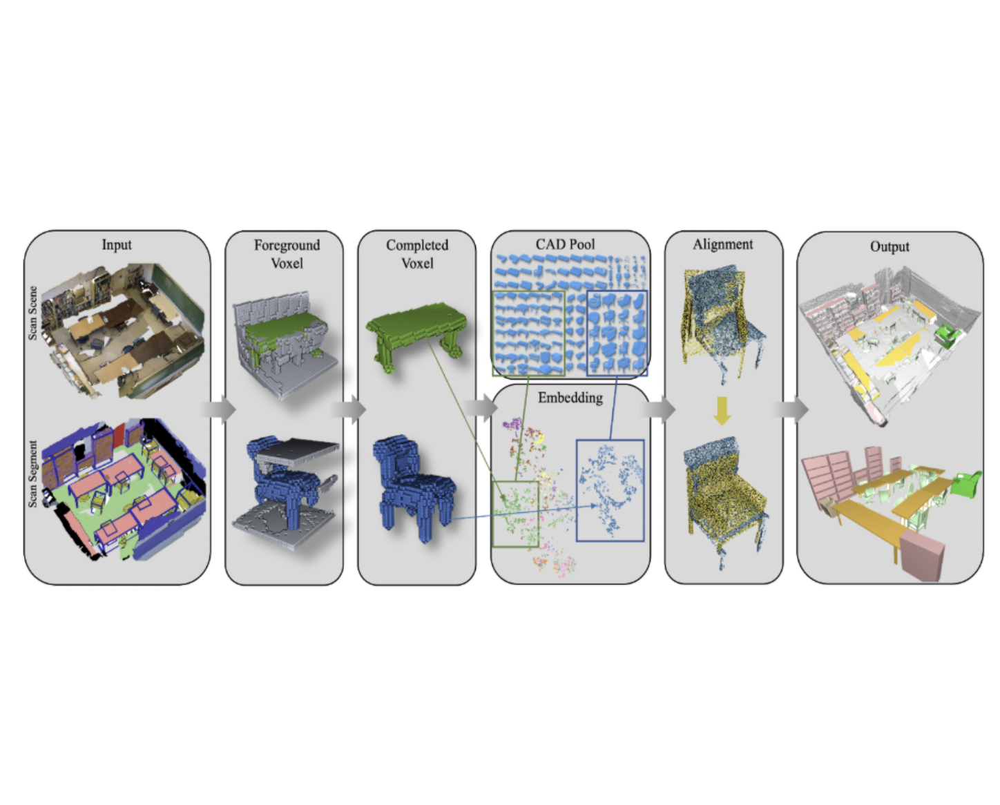**Real2CAD: Shape Matching of Real 3D Object Data to Synthetic 3D CADs** (3DV project)

 **Yue Pan**, Bingxin Ke, [Yuanwen Yue](https://yueyw.net/), [Yujie He](https://yujie-he.github.io/), supervisor: [Iro Armeni](https://ir0.github.io/), [Shengyu Huang](https://shengyuh.github.io/)

[report](https://github.com/Real2CAD/Real2CAD-3DV/blob/main/doc/3DV_report_Real2CAD.pdf) / [code](https://github.com/Real2CAD/Real2CAD-3DV) / [dataset]()

.

--------------

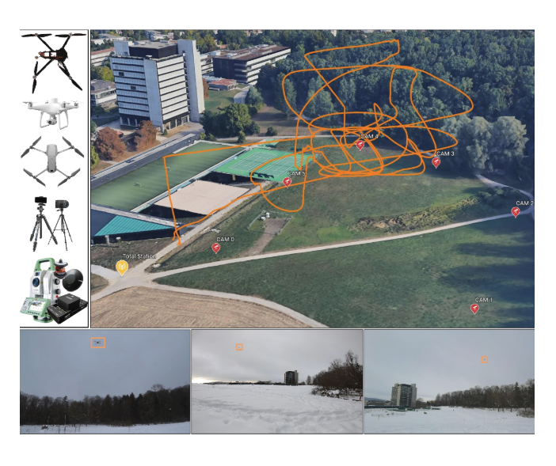**Measuring Drone Trajectory using Total Station with Visual Tracking**  (IPA semester project)

**Yue Pan**, supervisor: [Cenek Albl](https://igp.ethz.ch/personen/person-detail.html?persid=253019), [Jemil Butt](https://gseg.igp.ethz.ch/people/scientific-assistance/jemil-avers-butt.html), [Andreas Baumann-Ouyang](https://igp.ethz.ch/personen/person-detail.html?persid=162081), [Konrad Schindler](https://igp.ethz.ch/personen/person-detail.html?persid=143986)

[paper]() / [report](https://ethz.ch/content/dam/ethz/special-interest/baug/igp/photogrammetry-remote-sensing-dam/documents/pdf/Student_Theses/IPA_YuePan.pdf) / [code](https://github.com/YuePanEdward/drone-tracking-toolkits) / [dataset](https://github.com/CenekAlbl/drone-tracking-datasets)

.

-------

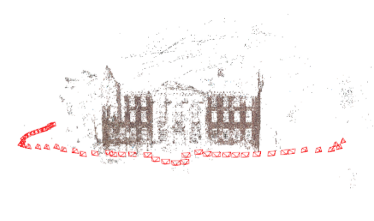**EasySFM: A simple Structure-from-motion toolbox** (P3DV project)

**Yue Pan**, supervisor: [Cenek Albl](https://igp.ethz.ch/personen/person-detail.html?persid=253019), [Jan Dirk Wegner](https://igp.ethz.ch/personen/person-detail.html?persid=186562)

[code](https://github.com/YuePanEdward/EasySFM)

--------

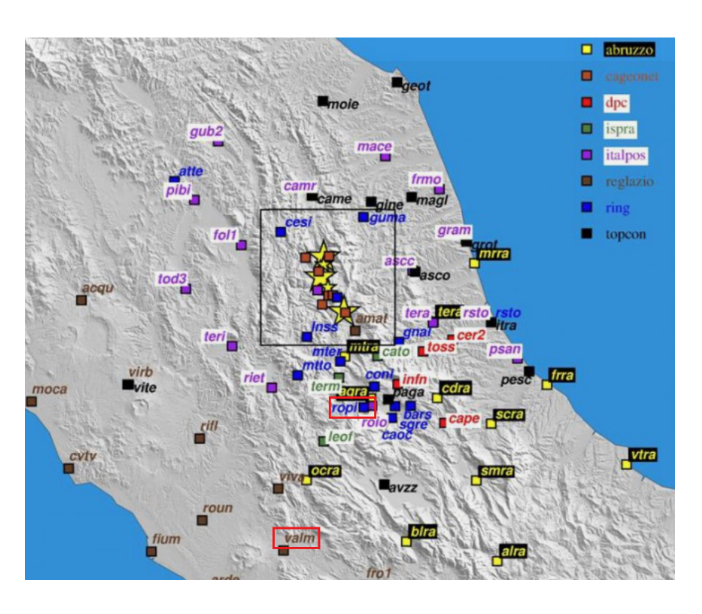**Comparison and analysis of real-time PPP and RTK at different baseline lengths** (GNSS Lab project)

Han Sun, **Yue Pan**, supervisor: [Hohensinn Roland](https://mpg.igp.ethz.ch/group/person-detail.html?persid=205027), [Möller Gregor](https://igp.ethz.ch/personen/person-detail.html?persid=268430)

[report](https://github.com/YuePanEdward/GNSSLab/blob/master/documents/GNSSLab_report_HanSun%26YuePan.pdf) / [code](https://github.com/YuePanEdward/GNSSLab)

.

--------

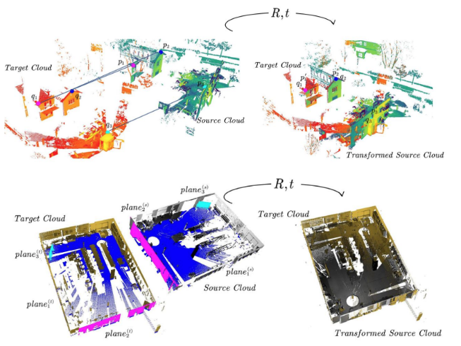**Target-less registration of point clouds: A review** (Geomatics Seminar)

**Yue Pan**, supervisor: [Jing Qiao](https://igp.ethz.ch/personen/person-detail.html?persid=254880), [Andreas Wieser](https://gseg.igp.ethz.ch/people/group-head/prof-dr--andreas-wieser.html) 

[report](https://arxiv.org/abs/1912.12756) / [link](https://github.com/YuePanEdward/point-cloud-registration-review)

.

-------

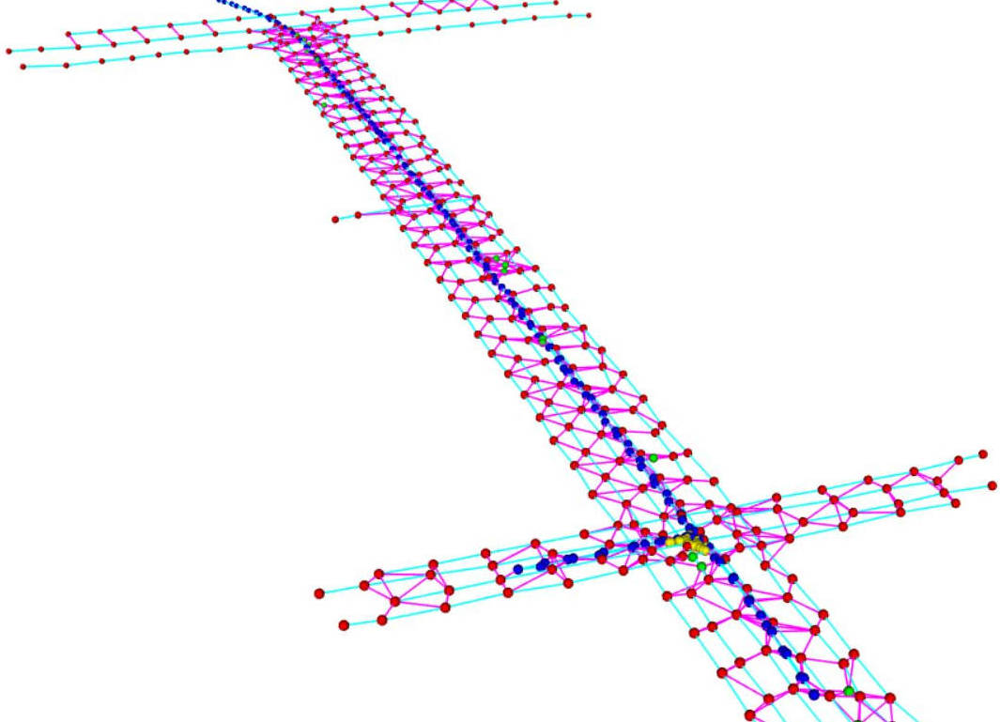**Cloud Control Net: Multi-template point cloud refinement & fusion** (bachelor thesis, 1st in the department)

 **Yue Pan**, Xin Zhao, supervisor: [Zhen Dong](http://jszy.whu.edu.cn/dongzhen/zh_CN/index.htm), Hong Xie

 [code](https://github.com/YuePanEdward/CloudControlNet)

-----

### 
Talk & Blog

[Talk on point cloud registration and Lidar SLAM at dianyunpcl (in Chinese)](https://www.bilibili.com/video/BV1Y54y1B7si?from=search&seid=10115392623998023724)

[Zhihu articles on geomatics technology (in Chinese)](https://www.zhihu.com/column/c_1088383916930469888)

---

### 
Misc

Hobby: *Soccer, Skiing*

-----

### 
Contact Information

Email: *yuepan@ethz.ch*

---

